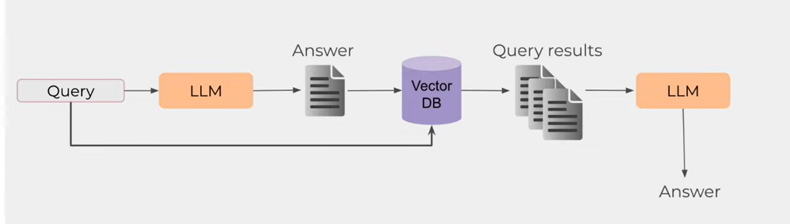

# SHL Assessment Recommendation System

This project implements a **simple LLM-based, retrieval-augmented recommendation system** for the SHL assignment.

The system recommends relevant **SHL Individual Test Solutions** based on:
- Natural language queries
- Job description text
- Job description URLs

---

## 🔗 Project Links

- **Web App URL:** https://assessmentrecommendation-y3wxlazwen8zz7zythiq8n.streamlit.app/
- **API URL:** https://shl-render.onrender.com/recommend
- **GitHub Repo:** https://github.com/555vedant/Assessment_Recommendation

---

## System Architecture



---

## How It Works

1. SHL product catalog is scraped and stored locally  
2. Assessments are converted into embeddings  
3. FAISS is used as a vector database  
4. An LLM is used for query understanding  
5. Relevant assessments are retrieved and ranked  
6. Balanced recommendations are returned  

---

## Deployment Constraints & Design Decisions (Important)

During deployment, the system was initially configured with **SentenceTransformer embeddings + FAISS** inside the live API.

However, the **Render free tier (512 MB RAM limit)** consistently caused **out-of-memory crashes** when loading:
- Embedding models
- Vector indices
- Torch runtime dependencies

## CSV Generation (Evaluation Mode)

The system generates a CSV file named:

```
predictions.csv
```

Format:
```
Query,Assessment_url
```

This CSV is used for automated evaluation using **Mean Recall@10**.

---

## Assignment Compliance

- Scraped SHL Individual Test Solutions  
- LLM-based query understanding  
- Retrieval-augmented pipeline  
- Balanced recommendations  
- Working web application  
- Correct CSV format for submission  

---

## Author

Vedant Kasar
